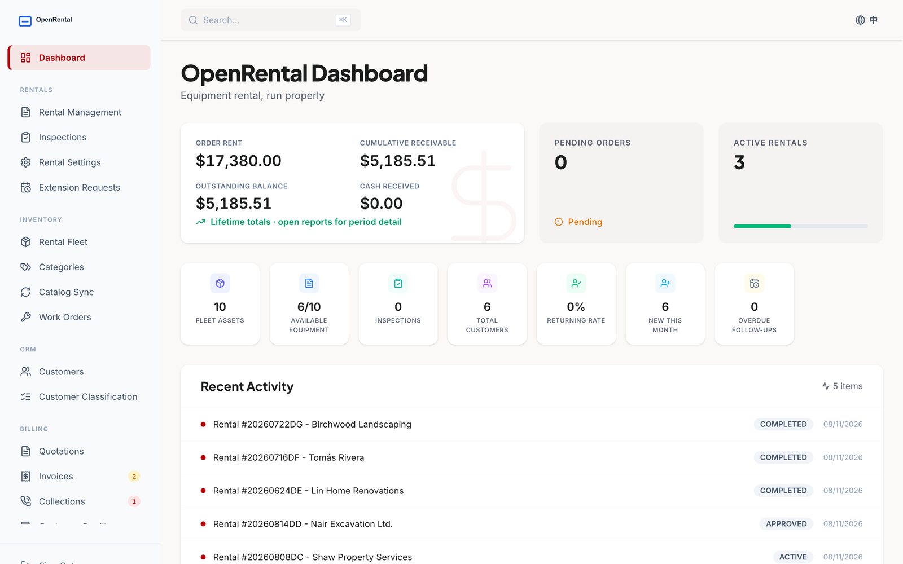
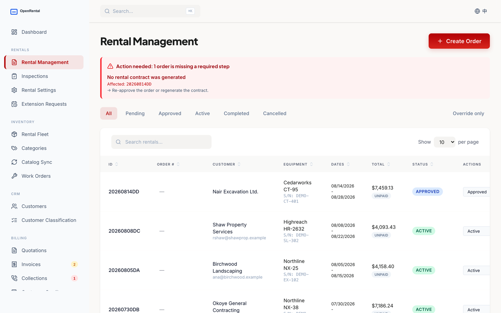
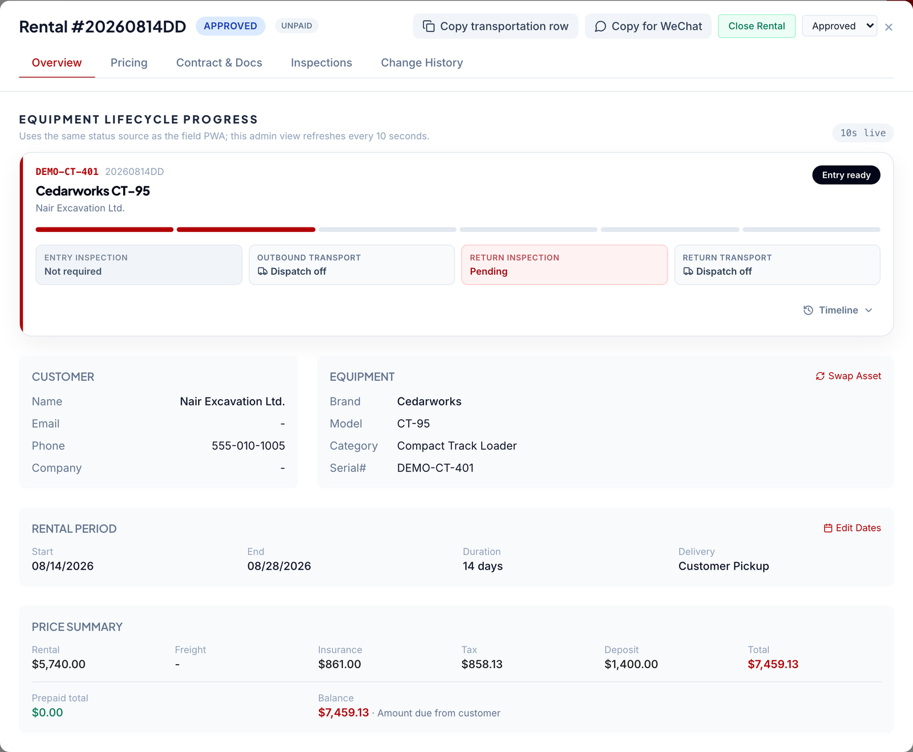
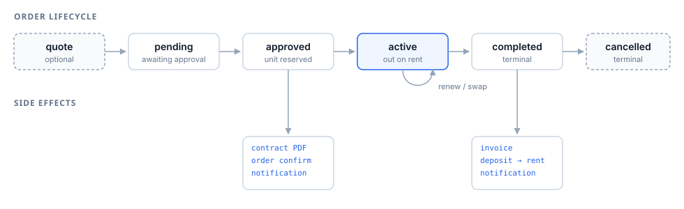
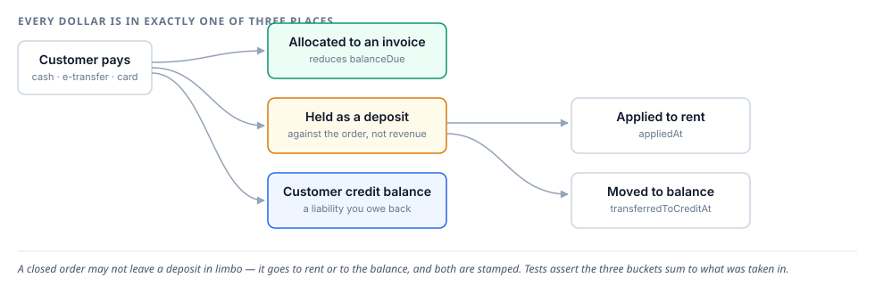
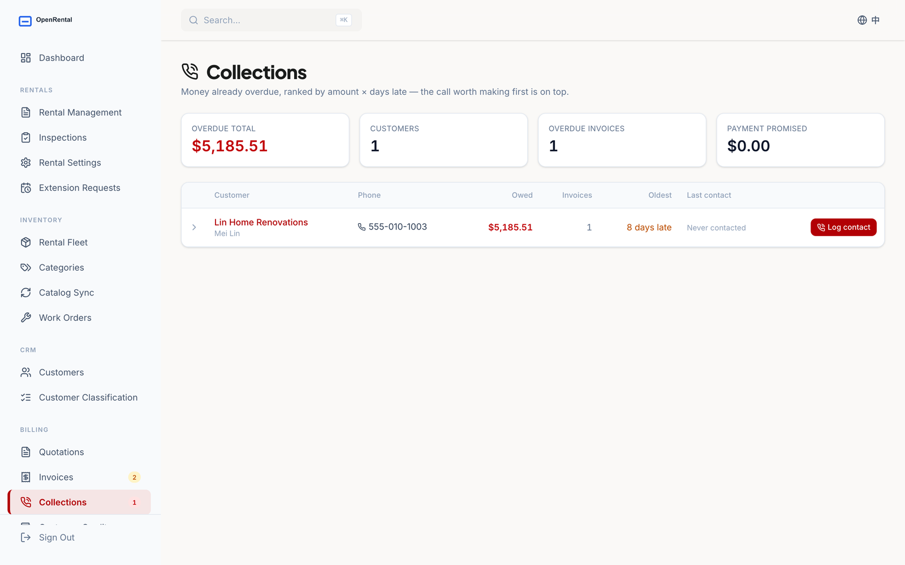
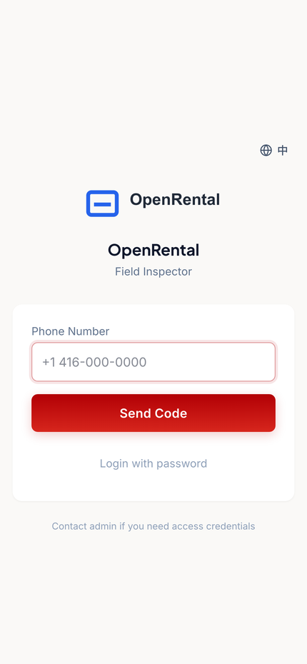

<div align="center">


### Equipment rental management, built for how North American yards actually run

Fleet ledger · order lifecycle · tiered pricing · invoicing & deposits · receivables · offline field PWA

[](https://github.com/qx04222/openrental/actions/workflows/ci.yml)
[](LICENSE)
[](#verify-it-yourself)
[](tsconfig.json)
[](sql/000_baseline.sql)

**[Quick start](#quick-start) · [What you get](#what-you-get) · [Why North America](#why-north-america) · [Project status](#project-status) · [Contributing](CONTRIBUTING.md)**

</div>

---



## Three things that make this different

<table>
<tr>
<td width="33%" valign="top">

### 💵 The money always adds up

Every dollar a customer pays is in exactly one of three places — allocated to an invoice, held as a deposit, or on their credit balance. Tests assert the sum. A closed order **cannot** leave a deposit in limbo.

</td>
<td width="33%" valign="top">

### 🔇 Silence is never success

A status field records bookkeeping state; a separate timestamp records delivery fact. A failed query renders as an error, never as `0`. Both rules exist because this system was burned by the alternative.

</td>
<td width="33%" valign="top">

### 🇨🇦 Built here, not localized later

Per-province GST/PST/HST with the breakdown stored on the invoice. Rental days are local calendar days. Deposits, damage claims and signature evidence follow North American rental practice.

</td>
</tr>
</table>

---

## Quick start

```bash
git clone https://github.com/qx04222/openrental.git && cd openrental
cp .env.example .env          # set DATABASE_URL
npm install
npm run db:baseline           # one SQL file, 63 tables
npm run seed && npm run seed:demo
npm run dev                   # → localhost:3000/admin   (admin / admin123)
```

Or evaluate it without installing a toolchain:

[](https://render.com/deploy?repo=https://github.com/qx04222/openrental)
[](https://railway.com/new/template?template=https://github.com/qx04222/openrental)

Both give you a private instance with its own Postgres. After the first deploy, open a shell on the service and run `npm run db:baseline && npm run seed && npm run seed:demo`.

Locally, with Docker:

```bash
docker compose up --build
docker compose exec app sh -c 'npm run db:baseline && npm run seed && npm run seed:demo'
```

The demo seed loads a fictional yard — ten machines across five categories, six customers, orders at every stage of the lifecycle, and one invoice deliberately aged past due — so every screen has something real on the first run.

---

## What you get

### Orders that survive contact with reality



Renting machines is not booking. A unit goes out Tuesday, comes back damaged and half-fuelled the following Monday, the customer already paid a deposit, the damage becomes a charge, the charge becomes a credit note, and six weeks later somebody has to phone them because the invoice is still open. All of that is modelled.

The banner at the top is the system naming orders that were started and then stalled — the class of work that quietly rots in every rental business.



One order, one screen: where the machine is in its lifecycle, what the customer owes, and how the total was built — rent, insurance, tax and deposit each on their own line instead of rolled into a number nobody can check.

### The lifecycle, and what each transition fires



Side effects are **claimed, executed, then settled**. If the process dies between generating the contract and writing the invoice, a retry cron finishes the unsettled half instead of leaving the order in a state nobody can reason about.

### Money you can audit



Issued financial documents are append-only. A waived charge on an issued invoice becomes an offsetting credit note — history is never edited.

### Receivables with a phone number attached



Ranked by **amount owed × days late**, because either dimension alone buries the other: a $200 invoice ninety days old and a $9,000 invoice two days old both deserve a call today. Each row carries the phone number, the invoices behind the balance, and what the customer said last time. Log a follow-up date and they collapse out of today's list until it arrives.

### A field PWA that works without signal

<div align="center"></div>

Dispatch and return inspections on a phone: photos, hour meter, fuel level, condition, customer signature. Inspections queue in IndexedDB and sync when the device gets signal — which on a job site is the normal case, not the edge case.

### And the rest

| Area | What it does |
|---|---|
| **Fleet ledger** | Assets, categories, attachments, serials, engine hours, maintenance windows. Availability is *derived* from real blockers, so the list badge and the assignment dropdown cannot disagree. |
| **Pricing** | Day / week / month / 28-day tiers, per-category defaults, customer contract rates, promotions, referral discounts, distance-banded delivery, configurable insurance. Multi-unit orders apportion correctly. |
| **Back office** | Five roles with per-module CRUD and per-user overrides, full audit log, recycle bin with restore, work orders, damage claims. |
| **Reports** | Utilization, fleet ROI, revenue by category and by customer industry, financing plans, aged receivables. |
| **Customer portal** | Phone-OTP login, own orders and invoices, optional card checkout. |

**63 tables · ~80k lines of TypeScript · 1,433 tests.**

---

## Why North America

Not a generic system with a currency dropdown bolted on.

- **Canadian tax, province by province.** `tax_rates` models GST, PST and HST separately, because they do not compose the same way — an HST province gets one line, a GST + PST province gets two. The breakdown is **stored on the invoice**, so a reprint six months later shows what the customer was actually charged, not what today's rates would produce.
- **A rental day is a local calendar day.** A machine returned at 8pm on the 3rd is a three-day rental whether or not UTC has rolled over. One timezone is authoritative, set once via `APP_TIMEZONE` — Toronto, Vancouver, Chicago, Phoenix, whatever your yard runs on. An invalid zone **fails at boot** rather than silently shifting every invoice by a day.
- **Deposits behave like rental deposits.** Held against the order, tiered by rental length, then explicitly applied to rent or moved to the customer's balance when the order closes. Money paid but not yet earned is tracked as a liability.
- **Damage and fuel become documents, not arguments.** A return inspection with a deficit generates a claim; the claim becomes an invoice line or a waiver.
- **Signature evidence you could hand to a lawyer.** Signature, document hash, IP, user agent, timestamp.
- **Bilingual English / Chinese**, including customer-facing documents — a large share of independent operators in the GTA, Greater Vancouver and California run bilingual front counters.

> **Not yet:** US state and local sales tax is not modelled — the tax engine is Canada-first. Adding a US strategy behind the existing `taxCalculation` interface is a well-scoped, high-value first contribution. → [`good first issue`](https://github.com/qx04222/openrental/labels/good%20first%20issue)

---

## Verify it yourself

```bash
npm run verify   # tsc + eslint + 1,433 tests + production build
```

The build step is not redundant with the type check — esbuild and Vite catch a class of error `tsc` does not see. CI runs all four, and it also applies the baseline schema and both seeds against a fresh Postgres, so "it installs from scratch" is verified on every commit rather than assumed.

---

## Stack

TypeScript end to end: Express + tRPC, Drizzle over PostgreSQL, React + Vite + Tailwind, Vitest, PDFKit. Ships as a single Node process behind any Postgres — nothing in the runtime is tied to a cloud vendor.

Optional integrations, every one off by default and visibly off rather than silently no-op: Resend (email), Telnyx (SMS), Stripe (card), Supabase Storage (photos and PDFs).

---

## Provenance

OpenRental was extracted from a system that ran a real rental business daily. **This repository starts at commit one on purpose** — the original history contained real customer names, phone numbers and addresses, so none of it was carried over. Removed before this repo existed: every real customer and order, the original branding and marketing site, one-off production data-repair migrations, and integrations with that operator's internal systems.

Every company, person, phone number and address in the seeds, fixtures, tests and docs is invented; phone numbers use the `555-01xx` range reserved for fiction. If you find anything that looks like it identifies a real person or business, please report it privately — see [SECURITY.md](SECURITY.md).

---

## Project status

**Extracted from production, maintained on a hobby schedule.** Worth knowing before you depend on it:

- The code has run a real rental business daily, so the business rules are load-bearing rather than theoretical — but it has run exactly *one* business. Expect assumptions that fit that yard and not yours.
- It is maintained by its author in spare time. **Issues may take a while, and some will be closed as out of scope.** That is not neglect; it is the honest capacity.
- No release cadence and no long-term support commitment yet. `main` is kept green — every commit runs type check, lint, 1,433 tests, a production build, and applies the baseline schema and both seeds to a fresh Postgres — but there are no tagged releases before 1.0.
- Pull requests are genuinely welcome, especially the ones listed below. A focused PR with a test is far more likely to be merged quickly than an issue asking for a feature.

If you are considering running this for real: read [SECURITY.md](SECURITY.md) first, change the seeded credentials, and treat pre-1.0 as pre-1.0.

## Contributing

Issues and PRs welcome — start with [CONTRIBUTING.md](CONTRIBUTING.md). Good places to begin:

- [**US sales tax**](https://github.com/qx04222/openrental/issues/9) behind the existing `taxCalculation` interface
- [**A second notification provider**](https://github.com/qx04222/openrental/issues/10) (Twilio, SendGrid) following the delivery-fact pattern
- [**Metric / imperial toggle**](https://github.com/qx04222/openrental/issues/11) for hour meters, weights and dimensions
- [**Accessibility pass**](https://github.com/qx04222/openrental/issues/12) on the admin tables

Each is written up with the constraints that matter and where to look — see all [`good first issue`](https://github.com/qx04222/openrental/labels/good%20first%20issue).

Docs: [architecture map](docs/index.md) · [rentals](docs/modules/rentals.md) · [money](docs/modules/money.md) · [customers](docs/modules/customers.md) · [database](docs/modules/database.md)

## License

[Apache-2.0](LICENSE). Use it commercially, fork it, run your own yard on it. A PR back is appreciated, never required.
